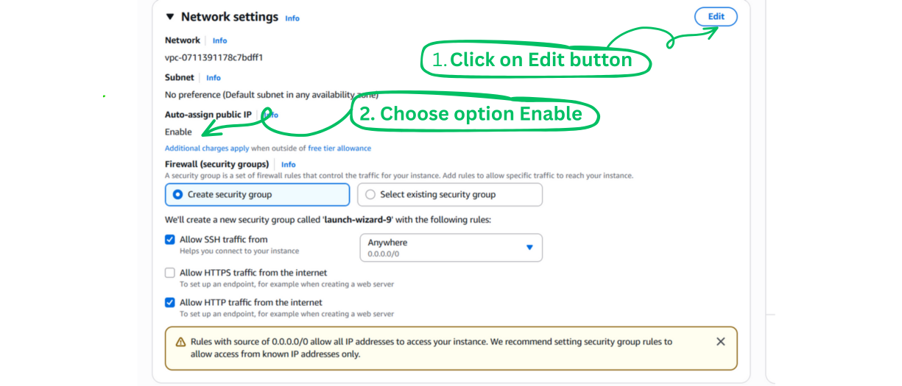
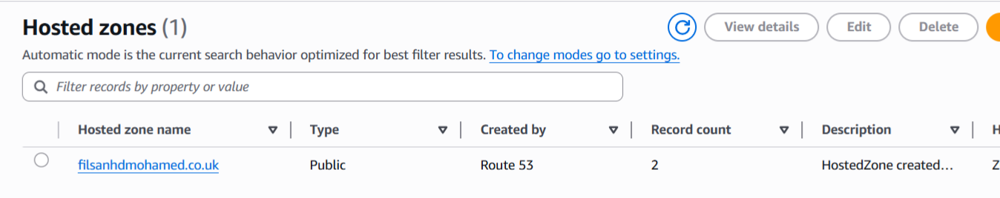

# Configure NGINX on Amazon EC2 with Route 53 DNS

### What is NGINX?

NGINX is a web server. That means that it is a program that listens when your browser asks for something and then sends back the right files, like HTML, CSS, JavaScript, or images, so that a website can show up on your screen quickly.

NGINX can also do more than just send files. A lot of people use NGINX together with other apps (like Node.js, Python, or Java apps) on the Amazon EC2 instance. In that setup, NGINX acts like a helper in front of your app. It can handle things like sharing the traffic between servers (load balancing), storing copies of pages (caching), handling secure connections (SSL), and serving static files (HTML, CSS, Javascript and images), while your app just focuses on running its own logic (doing what ever it was built for).

### 📄 Project Description

This project involves setting up a publicly accessible NGINX web server on an Amazon EC2 instance (which is a virtual computer running in the cloud). After launching an EC2 instance, NGINX is installed and configured to serve content (such as web pages) over HTTP on port 80, with the necessary inbound rules added to the EC2 instance’s security group to allow both SSH and HTTP traffic. To make the NGINX server reachable (in this for NGINX to show the default welcome page) through a domain name (in this case : nginx.filsanhdmohamed.co.uk) instead of just an IP address (as you can also view NGINX's welcome page by using the EC2 instance's IPv4 address, as you will see later on), an A record is created in the DNS provider Amazon Route 53. This A record points the domain to the public IP of the EC2 instance. As a result, you can open a browser and access the default NGINX welcome page simply by visiting the domain, which is in this case nginx.filsanhdmohamed.co.uk

---

### 🛠 Technologies Used

- Amazon EC2
- NGINX
- Amazon Route 53

---

### Pre-requisites

Before starting this project, make sure you have:

- 🌐 A registered domain name (you can buy one through Amazon Route 53 or any other domain registrar).
- 🔑 An AWS account with permissions to launch EC2 instances and manage Route 53.
- During this project, an Ubuntu machine was used in Oracle VirtualBox.

---

<br>

### Step 1: 🛒 Buy a domain name through Amazon Route 53


---

<br>

### Step 2: 🚀 Start the process of launching an Amazon EC2 instance. The Ubuntu machine was chosen here.


---

### Step 3: ⚙️ In the Instance Type section, choose the instance type: t2.micro


---

<br>

### Step 4: 🔑 In the Key pair (login) section, select: <u>Create a new key pair</u>. A window will appear, allowing you to download the key pair.

#### Download the key pair.

⚠️ **Remember:** It is best practice to create a separate key for each EC2 instance.  
That way, if a key is compromised, only that one instance is at risk.


---

<br>

### Step 5: In the network setting section, click on edit and enable the Auto-assign public IP address.

Enabling auto‑assign public IP means that a public IPv4 address is automatically assigned to the EC2 instance when it launches (when it is created). Because of the EC2 instance's public IPv4 address, the EC2 instance can be accessed from the internet.

⚠️ **Be aware:** Although you will understand this after you have read all the steps of this project, it will be mentioned here, so you can always come back to read this part. Since you have enabled the default auto-assigned public IP, this will automatically give your EC2 instance an IPv4 address, when it launches(or is created) , so if you stop the EC2 instance after it has been launched at a later stage and start it again later on (stop/start EC2 instance), your EC2 instance could be assigned a new public IPv4 address. This means you will have to update the DNS record, in other words update the value field/section with the new public IPv4 address your EC2 instance has been given after you stopped the EC2 instance and started the EC2 instance. If you do not update the DNS record with the new IPv4 address, the domain (in thise case : nginx.filsanhdmohamed.co.uk) would still be pointing to the old IPv4 address and therefore the website would stop working.

- This is outside the scope of this project, but an Elastic IP provides a static IPv4 address that remains the same even if you stop and start your EC2 instance.



---

<br>

### Step 6: In the Network settings section, under the Firewall(Security Groups), keep Create security group selected, if this is your first setup. Furthermore, add the following rules to this security group: 1. Allow SSH traffic 2. Allow HTTP traffic from the internet.

Allowing SSH traffic opens port 22 which helps you to connect to your EC2 instance.

Allowing HTTP traffic (= web traffic) from the internet opens port 80, as port 80 is the default port for HTTP, so your web server’s (in this case it will be NGINX's) HTTP endpoint can be accessed from anywhere.


---

<br>

### Step 7: Launch the EC2 instance.


---

<br>

### Step 8: You will see this message after you have successfully launched the instance.


---

<br>

### Step 9: The EC2 instance is running now.


---

<br>

### Step 10: In the inbound rules tab of your security group, verify that the rules you selected in step 6 such as SSH on port 22 and HTTP on port 80 are listed.


---

<br>

### Step 11: Click on Connect above the EC2 instance and you will be directed to the Connect to instance page, with the SSH client tab selected by default, as you can see in the 2nd screenshot.


<br>


---

<br>

### Step 12: The screenshot below is from an Ubuntu machine that was launched in Oracle VirtualBox. Navigate to the Desktop, create a directory/folder called Nginx, navigate to the directory/folder Nginx and drag the file that has the key inside, that you downloaded in step 4 , to the Nginx folder. In this case, it was the Nginx-key.pem file that was put into the Nginx folder.

```
Step 1. cd Desktop
step 1. mkdir Nginx
step 2. cd Nginx

```


---

<br>

### Step 13: To ensure only you have access to this key, run the following command:

```
chmod 400 "Nginx-key.pem"
```

- chmod changes file permissions in Linux/Unix.
  <br>

- 400 sets the file’s permissions to: That it can be read by the owner (the user account that owns the file).


---

<br>

### Step 14: Copy the ssh command (at the bottom of the screenshot, this is the same screenshot from Step 11) from the Connect to instance page and run it in your terminal, in the Nginx folder you created for step 12, to connect to your EC2 instance (as you can see in the 2nd screenshot below).


<br>


---

<br>

### Step 15: You are now connected to the Amazon EC2 instance via SSH.


---

<br>

### Step 16: Install Nginx using the following command, as you can see in the screenshot below as well:

```
sudo apt update -y && \
sudo apt install nginx
```


---

<br>

### Step 17: Once the installation of Nginx is complete, check if Nginx is running by using the following command, like in the screenshot:

```
sudo systemctl status nginx
```


In this case, the status of Nginx was: active, Nginx was running. However, if Nginx is not active/not running in your case, you can start Nginx with the following command:

```
sudo systemctl start nginx

```

---

<br>

### Step 18: When you stop and then start your EC2 instance again, or if it reboots for any reason (e.g., AWS maintenance or a crash), NGINX will automatically start running without you having to manually start it if you use the following command, like done in the screenshot below:

```
sudo systemctl enable nginx
```


---

<br>

### Step 19: To get the EC2 instance's public IPv4 address, you select the EC2 instance like it has been done in the 2nd screenshot and the details will show up at the bottom. Copy the EC2 instance's public IPv4 address.


<br>


<br>

### Step 20: If you put the EC2 public Ipv4 address in the browser now, you should see the Nginx default welcome page, like in the screenshot below:

<br>


### ⚠️However, this is not what we want. We want the domain name nginx.filsanhdmohamed.co.uk pointing to the public IP of the EC2 instance.

### Step 21: You go to the hosted zones in Amazon route 53 and click on your domain name.



<br>

### Step 22: Click on create record.


### Step 23: The subdomain was given the name nginx as you can see in the screenshot below, the Rercord type was set to A, and the public IP of the EC2 instance was put into the value section as you can see in the screenshot below.

Here, you have created an A record in DNS that points your domain name to the EC2 IP.


### Step 24: The below message will appear and the website is now live and accessible via the domain name nginx.filsanhdmohamed.co.uk.


### Step 25: The website was accessed via the domain name nginx.filsanhdmohamed.co.uk.


### Documentation resources

- [NGINX Deployment Guide on Amazon EC2](https://docs.nginx.com) — Official NGINX documentation for deploying on AWS EC2.
- [Amazon Web Services (AWS) Documentation](https://docs.aws.amazon.com/) — Official AWS documentation and user guides.
